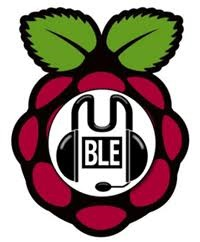

Mumble VoIP Server using Raspberry Pi.

## Getting started

Running this project is as simple as deploying it to a balenaCloud application.

One-click deploy to balenaCloud:

[](https://dashboard.balena-cloud.com/deploy)

**or**

- Sign up on [balena.io](https://balena.io/) and follow our [Getting Started Guide](https://balena.io/docs/learn/getting-started).
- Clone this repository to your local workspace.
- Unset (delete) the environment variable `BALENA_HOST_CONFIG_gpu_mem` or `RESIN_HOST_CONFIG_gpu_mem` if exists, from the `Fleet Configuration` application side tab.
- Set these variables in the `Fleet Configuration` application side tab
  - `BALENA_HOST_CONFIG_start_x` = `1`
  - Set all the following `gpu_mem` variables so your Pi can autoselect how much memory to allocate for hardware accelerated graphics, based on how much RAM it has available

    | Key                                  | Value
    |--------------------------------------|----------
    |**`BALENA_HOST_CONFIG_gpu_mem_256`**  | **`192`**
    |**`BALENA_HOST_CONFIG_gpu_mem_512`**  | **`256`**
    |**`BALENA_HOST_CONFIG_gpu_mem_1024`** | **`448`**
- Using [Balena CLI](https://www.balena.io/docs/reference/cli/), push the code with `balena push <application-name>`.
- See the magic happening, your device is getting updated 🌟Over-The-Air🌟!
- In order for your device to be accessible over the internet, toggle the switch called `PUBLIC DEVICE URL`.
- Once your device finishes updating, you can watch the live feed by visiting your device's public URL.

### Password Protect your balenaCam device

To protect your balenaCam devices using a username and a password set the following environment variables.

| Key            | Value
|----------------|---------------------------
|**`username`**  | **`yourUserNameGoesHere`**
|**`password`**  | **`yourPasswordGoesHere`**

💡 **Tips:** 💡 
* You can set them as [fleet environment variables](https://www.balena.io/docs/learn/manage/serv-vars/#fleet-environment-and-service-variables) and every new balenaCam device you add will be password protected.
* You can set them as [device environment variables](https://www.balena.io/docs/learn/manage/serv-vars/#device-environment-and-service-variables) and the username and password will be different on each device.

### Optional Settings

- To rotate the camera feed by 180 degrees, add a **device variable**: `rotation` = `1` (More information about this on the [docs](https://www.balena.io/docs/learn/manage/serv-vars/)).
- To suppress any warnings, add a **device variable**: `PYTHONWARNINGS` = `ignore`

## Become a balena poweruser

Want to learn more about what makes balena work? Try one of our [masterclasses](https://www.balena.io/docs/learn/more/masterclasses/overview/). Each lesson is a self-contained, deeply detailed walkthrough on core skills to be successful with your next edge project.

Check them out at our [docs](https://www.balena.io/docs/learn/more/masterclasses/overview/). Also, reach out to us on the [Forums](https://forums.balena.io/) if you need help.

## License

Copyright 2018 Balena Ltd.

Licensed under the Apache License, Version 2.0 (the "License"); you may not use this file except in compliance with the License. You may obtain a copy of the License at

<http://www.apache.org/licenses/LICENSE-2.0>

Unless required by applicable law or agreed to in writing, software distributed under the License is distributed on an "AS IS" BASIS, WITHOUT WARRANTIES OR CONDITIONS OF ANY KIND, either express or implied. See the License for the specific language governing permissions and limitations under the License.

[](https://travis-ci.org/ernestgwilsonii/docker-raspberry-pi-mumble-server)
# docker-raspberry-pi-mumble-server
Mumble server (in a Docker Container) for Raspberry Pi

```
############################################
# Mumble Server in Docker for Raspberry Pi #
#            REF: https://wiki.mumble.info #
############################################


###############################################################################
# Download the repo
cd /tmp
git clone https://github.com/ernestgwilsonii/docker-raspberry-pi-mumble-server.git
cd docker-raspberry-pi-mumble-server

# Mumble Releases REF: https://github.com/mumble-voip/mumble/releases
MUMBLE_SERVER_VERSION=$(cat version.txt)
echo $MUMBLE_SERVER_VERSION
export MUMBLE_SERVER_VERSION=$MUMBLE_SERVER_VERSION

# Docker build
time docker build --build-arg MUMBLE_SERVER_VERSION=$MUMBLE_SERVER_VERSION -t ernestgwilsonii/docker-raspberry-pi-mumble-server:$MUMBLE_SERVER_VERSION -f Dockerfile.armhf .

# List images and examine sizes
docker images

# Verify 
docker run -it -p 64738:64738/tcp -p 64738:64738/udp ernestgwilsonii/docker-raspberry-pi-mumble-server:$MUMBLE_SERVER_VERSION
# From another ssh session:
#docker ps

# Upload to Docker Hub
docker login
docker push ernestgwilsonii/docker-raspberry-pi-mumble-server:$MUMBLE_SERVER_VERSION
# Update the latest tag to point to the updated version
docker tag ernestgwilsonii/docker-raspberry-pi-mumble-server:$MUMBLE_SERVER_VERSION ernestgwilsonii/docker-raspberry-pi-mumble-server:latest
docker push ernestgwilsonii/docker-raspberry-pi-mumble-server:latest
# REF: https://hub.docker.com/r/ernestgwilsonii/docker-raspberry-pi-mumble-server
###############################################################################


###############################################################################
# First time setup #
####################
# Create bind mounted directories/files
sudo mkdir -p /opt/mumble-server/logs
sudo cp mumble-server.ini /opt/mumble-server/mumble-server.ini
sudo chmod -R a+rw /opt/mumble-server

##########
# Deploy #
##########

# Docker (without Swarm)
docker run --name mumble_server -d -v /opt/mumble-server/mumble-server.ini:/etc/mumble-server.ini -v /opt/mumble-server:/var/lib/mumble-server -v /opt/mumble-server/logs:/var/log/mumble-server -p 64738:64738/tcp -p 64738:64738/udp ernestgwilsonii/docker-raspberry-pi-mumble-server:1.3.4

# Verify
docker ps
docker logs -f mumble_server


# Deploy the stack into a Docker Swarm
docker stack deploy -c docker-compose.yml mumble_server
# docker stack rm mumble_server

# Verify
docker ps
docker service ls | grep mumble_server
docker service logs -f mumble_server_mumble-server
ls -alF /opt/mumble-server/
```
